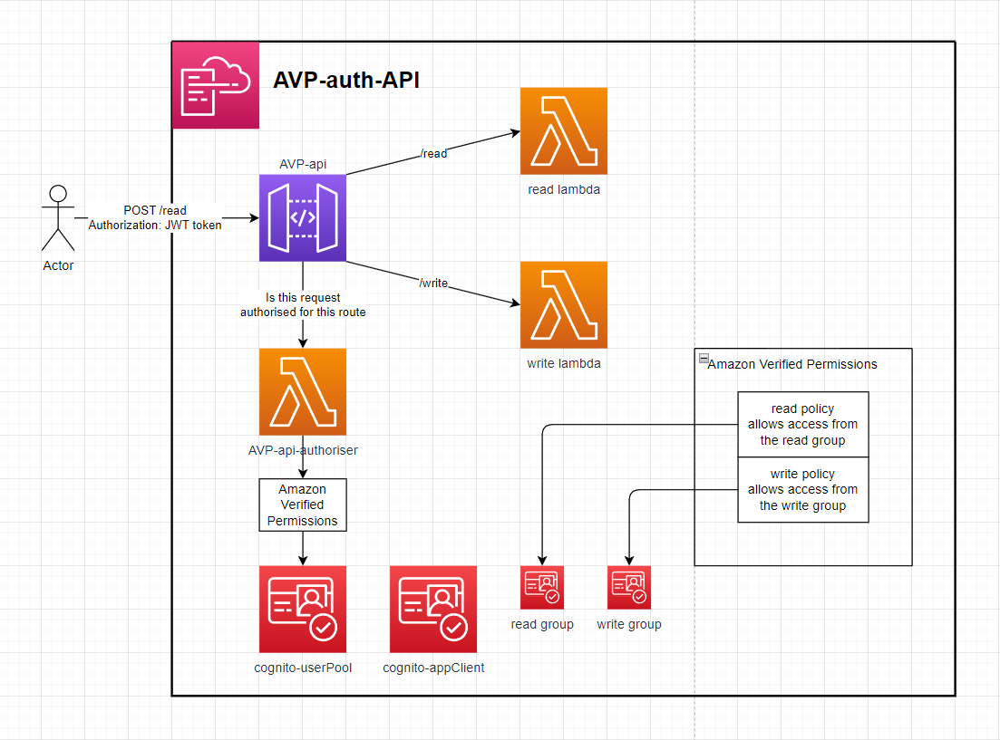

# AVP-auth-api

This API is backed by a Lambda Authorizer that uses `Amazon Verified Permissions` `(AVP)` as a cedar policy store and authentication evaluation engine. This can faliciate `RBAC` & `ABAC` logic.

# Setup
1. Deploy the Application with a given stack name & AVP namespace (used in policy logic)
2. Create a user in the deployed Cognito user pool, Add that user to the READ and or WRITE group & log in to the appClient to retrieve a JWT token.
3. Make a request to the API url from the stack outputs with the Authorization header as the JWT token.
4. If the Cognito user is in the Cognito read group then they'll have access to the /read endpoint. If they've in the write group then they'll have access to the /write endpoint.